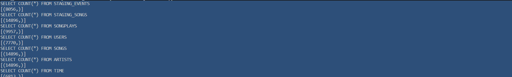
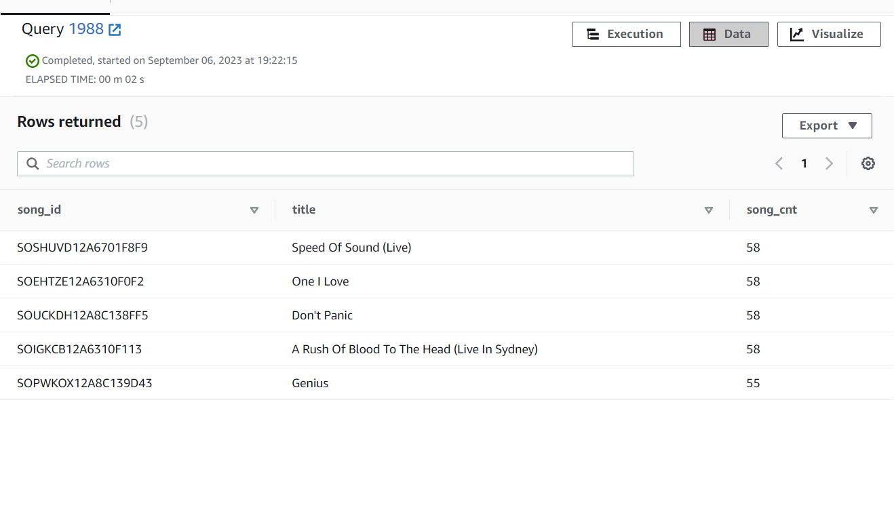

# PROJECT-2: Data Warehouse

## Quick start

*  provision redshift cluster use `redshift-setup-doc`
* `python3 create_tables.py` (to create the DB to AWS Redshift)
* `python3 etl.py` (to process all the input data to the DB)

---

## Overview

This Project-2 handles data of a music streaming startup, Sparkify. Data set is a set of files in JSON format stored in AWS S3 buckets and contains two parts:

* **s3://udacity-dend/song_data**: song data set with example as
  
  `{"num_songs": 1, "artist_id": "ARJIE2Y1187B994AB7", "artist_latitude": null, "artist_longitude": null, "artist_location": "", "artist_name": "Line Renaud", "song_id": "SOUPIRU12A6D4FA1E1", "title": "Der Kleine Dompfaff", "duration": 152.92036, "year": 0}`

* **s3://udacity-dend/log_data**: Event data set with example as 

    `{"artist":"Pavement", "auth":"LoggedIn","firstName":"Celeset","gender":"F","itemInSession":0,"lastName":"Cruz","length":23.22,"level":"free","location":"Mumbai",method:"GET","page":"NextSong","registration":"ABBCCC","sessionId":444,"song":"Mercy:The Laundromat","status":200,"ts":2323232323232,"userAgent":"Android","userId":44}`

* **s3://udacity-dend/log_json_path.json**: Meta data about event data file


Project builds an ETL pipeline which fetched data from JSON files stored in AWS S3 and insert the data to AWS Redshift DB.

---

## About Database

We are currently using staging tables and start design means that it has one Fact Table having business data, and supporting Dimension Tables. As part of this setup we are trying to ans one of the questions: What are the most played songs by user. DB schema is the following:

### Staging tables

* **staging_events**: event data telling what users have done (columns: artist, auth, firstName, gender, itemInSession, lastName, length, level, location, method, page, registration, sessionId, song, status, ts, userAgent, userId)
* **staging_songs**: song data about songs and artists (columns: num_songs, artist_id, artist_latitude, artist_longitude, artist_location, artist_name, song_id, title, duration, year)

Analysis:

* Both tables are using key distribution strategy and key we are using is artist and artist_name from events and songs tables respectively. We are using this key so that we can avoid shuffling in join operation for select-insert to fetch and insert this data in songplays table.

### Fact Table

* **songplays**: song play data together with user, artist, and song info (songplay_id, start_time, user_id, level, song_id, artist_id, session_id, location, user_agent)

### Dimension Tables

* **users**: user info (columns: user_id, first_name, last_name, gender, level)
* **songs**: song info (columns: song_id, title, artist_id, year, duration)
* **artists**: artist info (columns: artist_id, name, location, latitude, longitude)
* **time**: detailed time info about song plays (columns: start_time, hour, day, week, month, year, weekday)

Analysis:

* We are using all distribution strategy for time, artists and user table as this will avoid shuffling for us when joining with fact table. 
* We are using key distribution strategy for songplays and song table and our key is song_id. This will help us to distribute data basesd on listened songs but yes there will be some partition for songs which are less busy compared to other which are more busy based on listening songs.

---


## Queries

* Count Result


* Get TOP 5 most played songs
```
SELECT so.song_name,count(sp.song_id) as song_cnt
FROM SONGPLAYS as SP
        JOIN SONGS SO ON(SP.song_id = SO.song_id)
GROUP BY SP.song_id
ORDER BY song_cnt desc 
LIMIT 5

```

