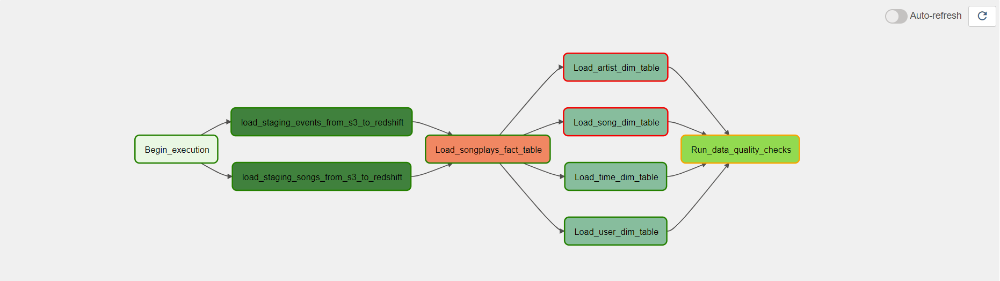

# PROJECT-4: Data Pipeline with Airflow

## Overview

A music streaming company, Sparkify, has decided that it is time to introduce more automation and monitoring to their data warehouse ETL pipelines and come to the conclusion that the best tool to achieve this is Apache Airflow.

* **s3://udacity-dend/song_data**: song data set with example as
  
  `{"num_songs": 1, "artist_id": "ARJIE2Y1187B994AB7", "artist_latitude": null, "artist_longitude": null, "artist_location": "", "artist_name": "Line Renaud", "song_id": "SOUPIRU12A6D4FA1E1", "title": "Der Kleine Dompfaff", "duration": 152.92036, "year": 0}`

* **s3://udacity-dend/log_data**: Event data set with example as 

    `{"artist":"Pavement", "auth":"LoggedIn","firstName":"Celeset","gender":"F","itemInSession":0,"lastName":"Cruz","length":23.22,"level":"free","location":"Mumbai",method:"GET","page":"NextSong","registration":"ABBCCC","sessionId":444,"song":"Mercy:The Laundromat","status":200,"ts":2323232323232,"userAgent":"Android","userId":44}`

* **s3://udacity-dend/log_json_path.json**: Meta data about event data file

Project builds an ETL airflow pipeline which fetched data from JSON files stored in AWS S3 and insert the data to AWS Redshift DB.

---

## About Database

We are currently using staging tables and start design means that it has one Fact Table having business data, and supporting Dimension Tables. 

### Staging tables

* **staging_events**: event data telling what users have done (columns: artist, auth, firstName, gender, itemInSession, lastName, length, level, location, method, page, registration, sessionId, song, status, ts, userAgent, userId)
* **staging_songs**: song data about songs and artists (columns: num_songs, artist_id, artist_latitude, artist_longitude, artist_location, artist_name, song_id, title, duration, year)

Analysis:

* Both tables are using key distribution strategy and key we are using is artist and artist_name from events and songs tables respectively. We are using this key so that we can avoid shuffling in join operation for select-insert to fetch and insert this data in songplays table.

### Fact Table

* **songplays**: song play data together with user, artist, and song info (songplay_id, start_time, user_id, level, song_id, artist_id, session_id, location, user_agent)

### Dimension Tables

* **users**: user info (columns: user_id, first_name, last_name, gender, level)
* **songs**: song info (columns: song_id, title, artist_id, year, duration)
* **artists**: artist info (columns: artist_id, name, location, latitude, longitude)
* **time**: detailed time info about song plays (columns: start_time, hour, day, week, month, year, weekday)

  Analysis:

  * We are using create-select strategy to fill all our dimensions table and fact table

### Code Structure
Project structure is using below operators to perform the complete action

- StageToRedshiftOperator -- Move data from s3 to redshift stage table
- LoadFactOperator  - Expose operation to run sql statement and we are running create-select statement to create song_plays fact table.
- LoadDimensionOperator - Expose operation to run sql statement and also enable provision to truncate data in table if passed flag is set to true.
- DataQualityOperator - Expose operation to take sql query and expected output as input and check the same. We are checking below functionalities as part of data quality check
  * No userId should be empty in songplays table
  * We should be having two distinct level in  song_plays table

### Airflow Pipeline

